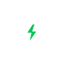

# Battery Mode Checker

  

  
  
  
  
  

  A focused, ultra-responsive native Android utility built with <b>Jetpack Compose</b> and <b>Material 3 Expressive</b> to audit, manage, and toggle the true background execution state of every application on your device.

---

## 📱 Direct Standalone Download

Download the pure production-signed `.apk` directly to your phone without extracting zip files:

  

  
  &nbsp;&nbsp;
  

> [!NOTE]
> **Production Signing Keystore**:
> All release builds are automatically signed with a persistent 2048-bit RSA production keystore preserved across builds in GitHub Actions CI. Verified with `apksigner` using APK Signature Schemes v1 & v2.

---

## ✨ Core Features

* ⚡ **Instant Tri-State Auditing**: Accurately classifies all installed packages into **Unrestricted** (Doze exempt), **Optimized** (Dynamic standby bucketing), or **Restricted** (`STANDBY_BUCKET_RESTRICTED`).
* 🎛️ **Live Mode Switching**: Directly toggle any application between Unrestricted, Optimized, and Restricted with one tap via [Shizuku](https://github.com/RikkaApps/Shizuku) and [Shevery](https://github.com/HmnDev-Tech/shevery) privileged binder IPC.
* 🛡️ **Strict Shizuku Guard Lock**: If Shizuku or Shevery is offline or lacks authorization, all app battery data, search controls, and distribution graphs are locked and hidden behind an expressive locked state container with direct authorization actions.
* 📊 **Native Canvas Capsule**: Smooth real-time multi-segment distribution bar rendered directly with Compose `Canvas` and physics-based spring animations.
* 🔍 **Ergonomic Top-Down Search**: Borderless 28dp pill search bar positioned directly above category filter chips for seamless thumb navigation.
* 🏷️ **Expressive Filter Chips**: Fully rounded pill chips (`CircleShape`) with category-specific tonal containers and discrete count badges.
* 🛡️ **Official Shizuku & Framework Vector Logos**:
  - Authentic Shizuku Arcticons 48x48 vector line art (`ic_shizuku_logo.xml`).
  - Dynamic status banner dynamically transitioning from primary accent to emerald green when connected.
  - Official Android (`ic_android_logo.xml`) and Jetpack Compose (`ic_jetpack_compose_logo.xml`) vector logos in `AboutScreen.kt`.
* 📱 **Async Package App Icons**: Real application icons fetched dynamically via `PackageManager` with graceful placeholders inside squircle frames.
* 🧭 **3-Dots Overflow Menu**: Quick access to Refresh, in-app Guide dialog, Show system apps toggle (hidden by default), and About page.
* 🎭 **Android 13+ Themed Icons**: Native Adaptive Icon bundled with a dedicated `<monochrome>` layer for dynamic Material You wallpaper theming.
* 🛡️ **Zero Telemetry & Offline**: 100% offline, zero internet permissions, zero analytics, and zero background services.

---

## 🛠️ Architecture & Specifications

| Component | Technology | Detail |
| :--- | :--- | :--- |
| **Platform** | Native Android | 100% Kotlin & Jetpack Compose (BOM 2024.10.01) |
| **Design Language** | **Material 3 Expressive** | Full surface container token layering, 28dp capsules |
| **Target / Min SDK** | Android 15 (API 35) / Android 8.0 (API 26) | Edge-to-edge transparent system bars |
| **Privilege Engine** | Shizuku API 13.1.5 | Reflection-based binder IPC (compatible with Shizuku & Shevery) |
| **State Management** | Kotlin Coroutines & `StateFlow` | Lifecycle-aware collection with `collectAsStateWithLifecycle` |
| **Binary Output** | Universal FAT APK | Multi-ABI support (`arm64-v8a`, `armeabi-v7a`, `x86_64`, `x86`) |
| **CI / CD** | GitHub Actions | Automated keystore persistence, static analysis, and releases |

---

## 📖 Background: Why This App Exists

In modern Android, battery optimization settings are buried deep within each individual application's system settings submenu. To inspect 150 installed apps, a user would need to navigate through 150 separate screens.

**Battery Mode Checker** consolidates everything into a single, unified dashboard:
1. **Unrestricted**: Exempt from Doze mode and background network/execution caps. Essential for VPNs, music streaming, VoIP, and navigation.
2. **Optimized**: Default dynamic App Standby Bucketing. Android throttles background work based on frequency of use.
3. **Restricted**: App is forcefully placed into `STANDBY_BUCKET_RESTRICTED`. Background tasks, alarms, and network access are aggressively restricted.

---

## 👤 Developer & Philosophy

Built with ❤️ by **Abhijeet Yadav** ([@mrdarksidetm](https://github.com/mrdarksidetm)).

This application adheres to the **Single-Purpose Utility Philosophy**: it is engineered to do one specific job with uncompromising precision, maximum performance, and zero bloat. Because its scope is tightly bounded, it requires no perpetual updates or tracking.

---

## 📄 License

This project is licensed under the [Apache License 2.0](LICENSE).
